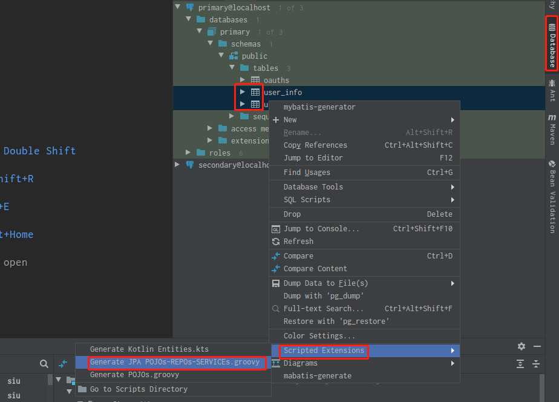
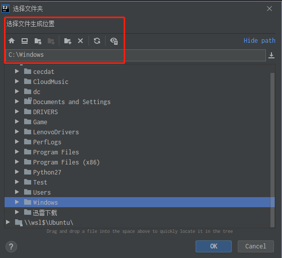

# Web 项目自动生成代码方案

发布时间：25/02/2020 14:09

主题来自：[siu91](https://github.com/siu91)  

截稿时间：07/03/2020 21:00


## 背景

```txt
背景描述：
项目中DO/PO，DAO，Service，Controller 这些代码大部分都是基础的，可以通过模板代码生成，提高开发效率，有哪些解决方案可以简化这样的操作步骤。
           
附加问题：Service层 需要接口和实现类吗，只有实现类不可以吗？
```


## 解决方案

来自@[siu91](https://github.com/siu91) 

```txt
方案1：IDE 插件+模板生成（如 Intellij IDEA CodeMaker，模板如Velocity） 
方案2：手写模板+一些API（mybatis-plus）
方案3：Intellij IDEA + intellij API + groovy脚本模板

  方案1是一个开源项目，插件+模板,再结合开源代码做自定义的开发，会是一个很不错的方案。【附1】
  方案2 是我们项目中用的，项目中用mybatis-plus做持久层操作，用它的AutoGenerator功能上满足，可视化操作欠佳，可以考虑往方案1和2上转或类似图形化操作。
  方案3，下面介绍一下。
```

使用IDEA + intellij API + groovy脚本模板自动生成代码。

先看使用效果：

- 选择数据源中的表（一张或多张）



- 使用扩展脚本生成（自定义的）代码，选择生成位置

  

- 使用方法

  ```txt
  1、将自定义groovy脚本放到 \.IntelliJIdeaxxxx\config\extensions\com.intellij.database\schema
  2、配置数据源： IDEA右侧导航视图选择 Database => +(添加) =>配置数据源
  3、生成：
           1） IDEA右侧导航视图选择 Database
           2）选择某个数据源
           3）选择 tables 下一张或多张表
           4）右键选择 Scripted Extensions
           5）选择你的groovy脚本
           6）视图界面打开选择生成的目录 => 完成
   
  Tips：
       1） Windows 可以用mklink 方式 放到 xxx\com.intellij.database\schema
            命令： mklink /h "xxx\com.intellij.database\schema\xxx.groovy" "文件原路径"
       2） Linux/MacOS 可以用对应的命令操作 （ln命令）
       3)  初次写groovy，不必太在意语法，直接像java那样写就好
       4） 可以参考内置的脚本：Generate POJOs.groovy
       5） 涉及的API 源码在：
           JetBrains\IntelliJ IDEA xxx\lib\src\src_database-openapi.zip
  
  ```

  

  

  


来自@[水哥](https://github.com/siu91) 

```txt
xxxxx
xxx
xxxx
xxx
```


## 总结

```txt
xxxx 方案在xxx场景下是一个好的解决方法
xxxx
xxxx
xxxx
xxxx
```


## 附录

- [附1-IDEA插件CodeMaker](https://github.com/x-hansong/CodeMaker)
- [附2-xxxx博客-关于如何设计xxxx的实践总结与思考](https://github.com/)
- [附3-xxxx博客-关于如何设计xxxx的实践总结与思考](https://github.com/)
