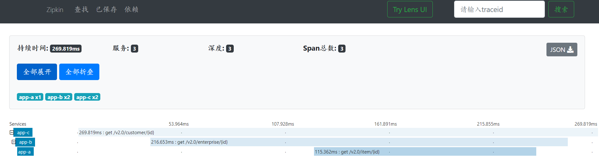
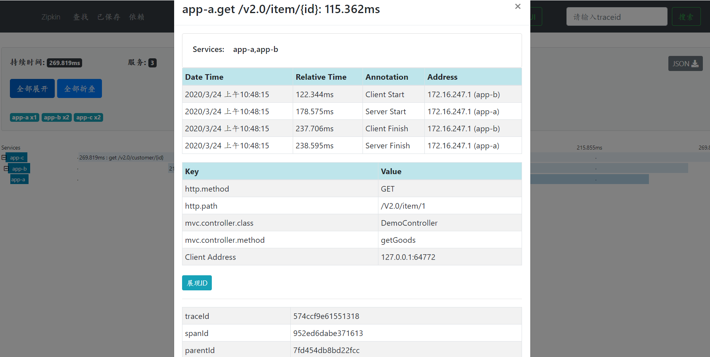
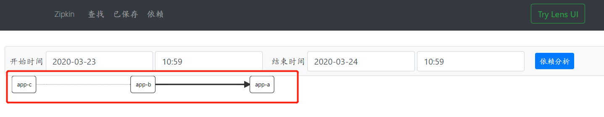

如何进行日志链路追踪

发布时间：27/02/2020 10:30

主题来自：[lcs559](https://github.com/lcs559)

截稿时间：14/03/2020 21:00


## 背景

```txt
业务背景描述：
作为开发者或运维，日志是进行问题定位的依据，面对复杂问题、在高并发场景和跨多服务业务等场景时，经常需要通过整个链路日志进行问题分析追踪，为此如何进行日志链路追踪至关重要。
PS: 日志链路追踪广泛应用在日志系统、溯源系统、数据挖掘等平台系统中
           
问题：基于以下问题，实现日志链路追踪都有哪些方案？
1、跨平台和服务日志链路
2、异步线程日志链路
3、内部定时器触发的日志链路
```


## 解决方案

来自@[siu91](https://github.com/siu91) 

```txt
1、单体应用
   a)基于log4j MDC，用Filter或Interceptor实现。（Filter会在Interceptor前之前，考虑不同业务场景使用）
   b) 参考zipkin+sentinel 的，每个追踪（Trace）设计成一个树状调用链,每个节点（Span）之间用子父结构标识（parentID，traceID），这种结构可以清晰的表达复杂的调用跟踪链路。
   c)
2、微服务/分布式
   a) zipkin + sentinel
   b)  SOFATracer https://github.com/sofastack/sofa-tracer
     基于HTTPclient 可以整合到单体应用的设计做参考（https://github.com/sofastack-guides/sofa-tracer-guides/tree/master/tracer-sample-with-httpclient）
  

```

来自@[lcs559](https://github.com/lcs559) 

```txt
一、在整个系统体系中，触发源有以下几点：
1、网络请求触发：web前端触发、服务间请求调用
2、定时调度触发
3、守护线程轮询触发
二、基于触发源，用log4j mdc进行追踪数据埋点：
1、网络请求触发：在Filter或Interceptor埋点
2、定时调度触发：在调度线程池的ThreadFactory进行埋点
3、守护线程轮询触发：守护线程每次轮询时将追踪数据埋点
4、异步线程间调用：将父线程的埋点数据传递给子线程

```
来自@[zhichao](https://github.com/squanche)
```txt
日志数据面向开发者和运维人员的场景，在处理开始时生成唯一标识（通过各种中间键），后续处理的链路传递这个标识，直到处理完成。
对于跨平台服务日志追踪，可以通过使用Kafka Connect实时获取打印日志信息，将日志信息汇聚于一个文件中，只要查询这个日志文件中日志的唯一标识，就能清晰的追踪到整个处理链路。
（PS：如果日志价值不大的是否有必要牺牲部分服务器性能用于处理日志）

```

来自@[Sev7nzy](https://github.com/Sev7nzy) 

```txt
1.使用Spring Cloud Sleuth+Zipkin进行分布式链路追踪。
以[appName,traceId,spanId,zipkin-export]的形式打印出日志，并对链路数据进行收集、存储、查找和展示。（附1）
2.使用Slf4j中MDC，服务间将traceId放入头部进行传递，通过前置拦截器或者过滤器统一拦截，配置logback进行日志打印。
```

1.Sleuth+Zipkin实现结果展示

* 新建app-A,app-B,app-C三个应用服务，各服务打印日志结果如下图：

  app-C:

  app-B:

  app-A:

* Zipkin结果展示

  请求链路信息展示如图：

  节点信息：

  服务间依赖关系：

2.MDC实现结果展示

* 各服务打印日志结果如下图：

  app-C:

  app-B:

  app-A:

来自@[drj-2020](https://github.com/drj-2020) 
方案描述：
https://github.com/drj-2020/article/blob/master/%E6%97%A5%E5%BF%97%E7%B3%BB%E7%BB%9F%E6%97%A5%E5%BF%97%E8%B7%9F%E8%B8%AA%E8%AE%BE%E8%AE%A1%E6%96%87%E6%A1%A3.md   

## 总结

```txt
基于上面的实现方式总结如下：
1.根据现有成熟的开源解决方案：zipkin + sentinel、Spring Cloud Sleuth+Zipkin
2.基于log4j mdc方案用过滤器、拦截器实现
3.根据数据源触发点出发考虑，基于log4j mdc方案实现

方案1和2 针对解决微服务服务链路的追踪，优点是有现成成熟的方案
方案3 从触发源考虑：包括微服务服务链路的追踪，以及定时任务，异步任务等触发源的解决方案
```


## 附录

- [附1-Spring Boot跟踪微服务日志](https://www.yiibai.com/spring-boot/spring_boot_tracing_micro_service_logs.html)
